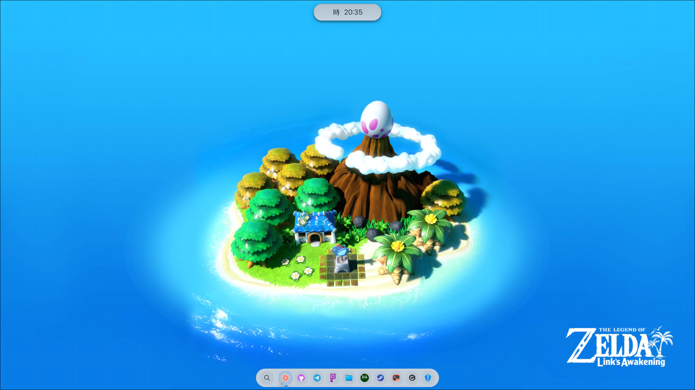
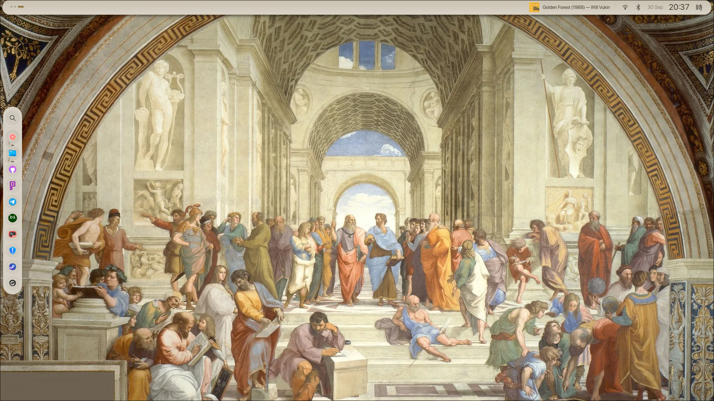
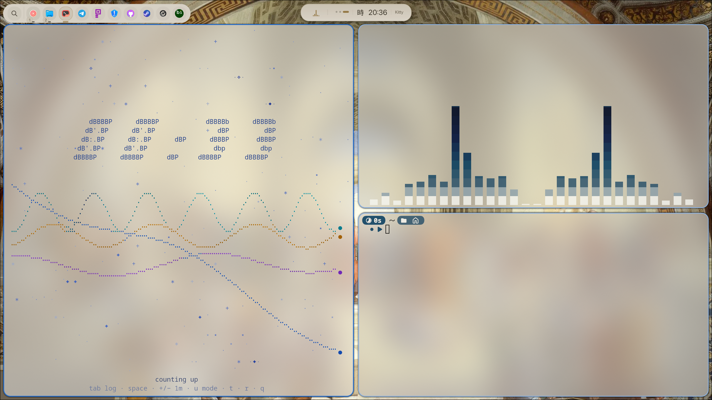
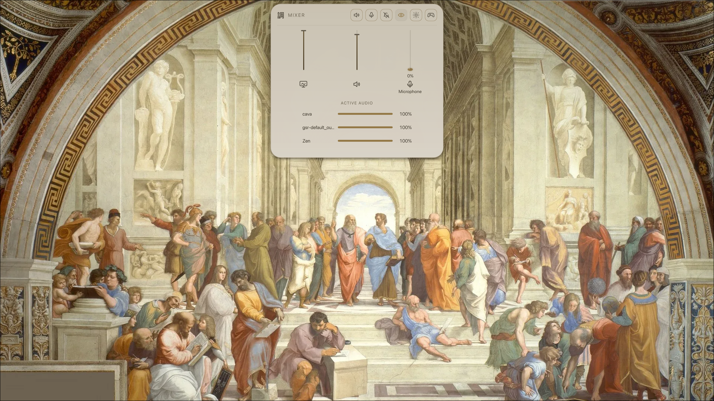
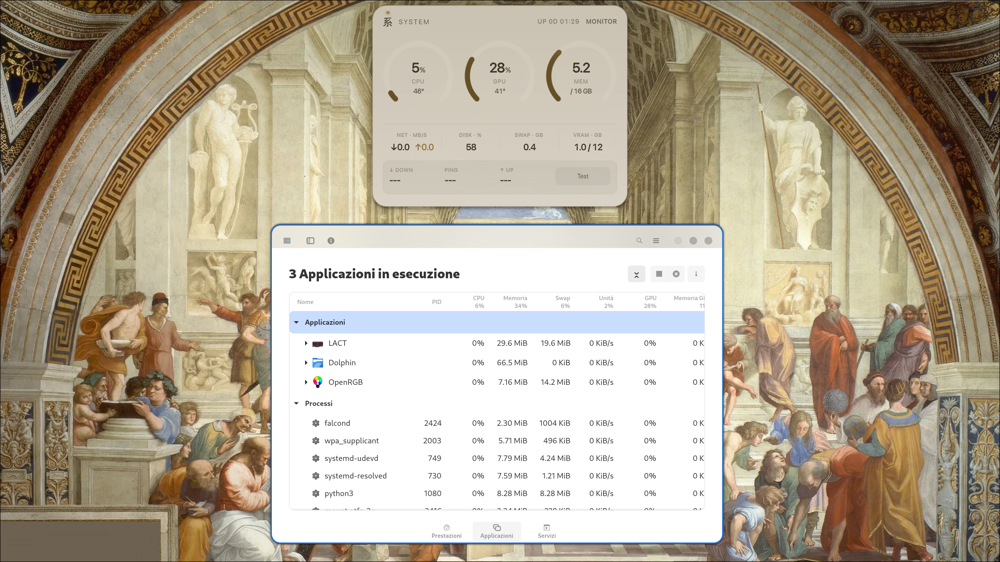
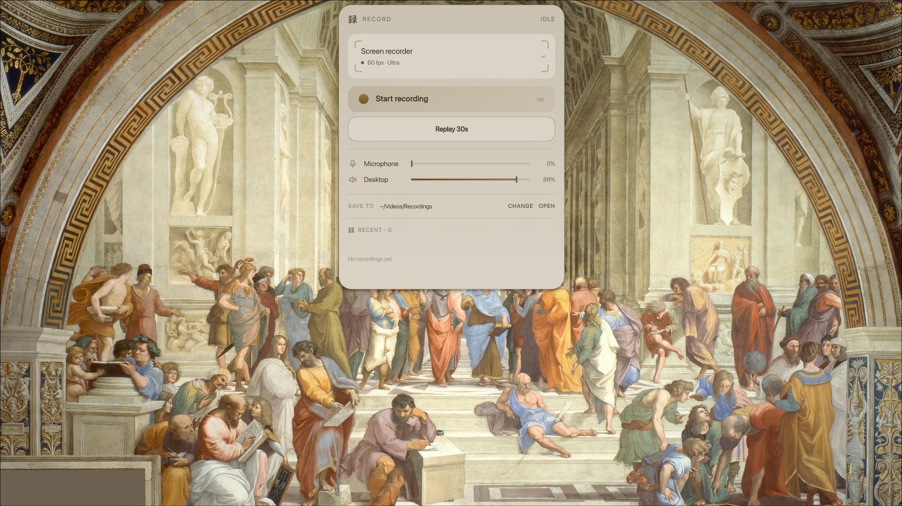
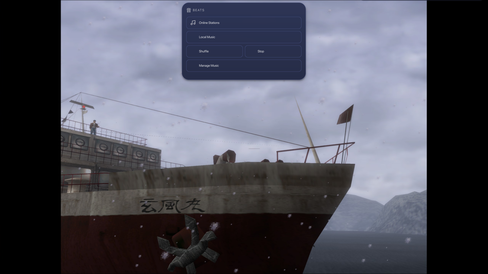
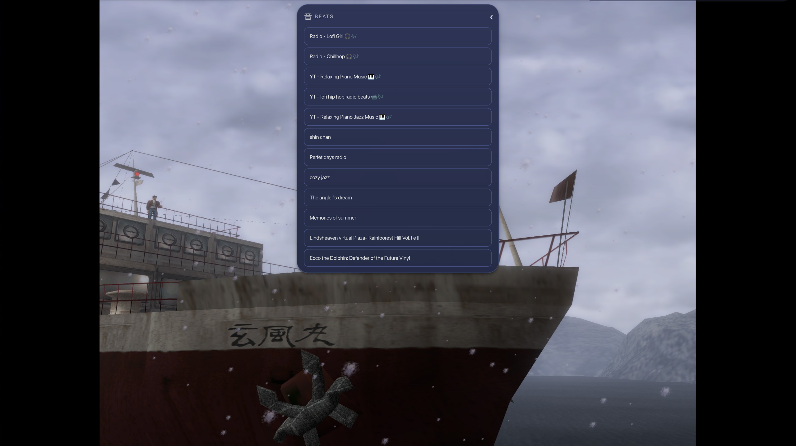

# Ukishima — Personal Fork

A personal fork of [Ukishima](https://github.com/amanhex/ukishima), extended and maintained as a customized desktop shell for **Quickshell**, **Wayland**, and **Hyprland**.

This fork preserves the original Ukishima architecture and visual philosophy while introducing additional components, integrations, configuration options, and desktop workflows developed for personal use.

## Overview

Ukishima is a modular desktop shell built with Quickshell and QML. It provides a unified interface for desktop navigation, system controls, media, application management, recording, and configuration.

This fork extends the original project with a particular focus on:

* Hyprland integration
* workspace-aware application management
* native application dock
* music management and playback
* per-application audio control
* screen recording and instant replay
* customized top-bar functionality
* configurable shell behavior
* Kanji and glyph-based interface elements
* consistent animations and visual design
* Wayland-native components

---

## Dependencies

The core shell requires:

* **Quickshell**
* **Qt / Qt Quick**
* **Wayland**
* **Hyprland**

Additional components may require the following tools:

* **PipeWire**
* **WirePlumber**
* **PulseAudio/PipeWire-compatible audio utilities**
* **FFmpeg**
* **wl-screenrec** or the recording backend used by the local recording scripts
* **grim** / other Wayland capture utilities where applicable
* **slurp** where region selection is required
* **playerctl** for media-player integration where supported
* **Network filesystem utilities** for remote music libraries, such as SMB/CIFS support

The exact dependencies depend on which parts of the shell are enabled.

For a complete installation, all components used by the recording, media, audio, and network-library workflows should be installed.

---

## Installation and Running

Clone the repository and enter the project directory:

```bash
git clone https://github.com/Mhurino/ukishima.git
cd ukishima
```

The shell can then be launched through Quickshell using the appropriate configuration entry point.

### Running a second instance

This fork is also designed to allow a second Ukishima instance to be launched independently when required.

This is useful for testing changes, running an isolated configuration, or developing a component without replacing the currently running shell instance.

A second instance should be launched using a separate Quickshell process/configuration rather than replacing the existing session.

> The exact command may depend on the local Quickshell configuration and the way the shell is started in the Hyprland session.

---

# Beats

**Beats** is an integrated music interface developed for this fork.

It provides separate workflows for local and online music, including:

* Local music library browsing
* Local music search
* Online music search
* Playback controls
* Music management
* Separate local and online views
* Network-based music libraries
* Fast browsing of large collections
* Integration with the shell's visual and animation system

### Local music libraries

The local library can operate on music stored on a mounted network filesystem.

This allows a remote music collection to be exposed locally while keeping the interface integrated into Ukishima.

The local search implementation is designed to avoid unnecessary filesystem operations and is suitable for large collections and network-mounted storage.

### Online music

Beats also provides an online workflow for searching and playing music without requiring the local library to contain the requested content.

The local and online workflows are intentionally separated to keep searching and library management predictable.

---

# Application Dock

This fork introduces a native application dock implemented directly within Ukishima.

The dock is not a separate desktop application. It is implemented as a Quickshell surface and uses the same visual components, themes, animations, and interaction model as the rest of the shell.

## Dock positions

The dock supports:

* Bottom
* Left
* Right
* Top-left
* Top-right

The top-corner configurations are treated as overlays and do not reserve permanent screen space.

## Dock behavior

The dock supports:

* Hidden-by-default edge activation
* Optional always-visible mode
* Configurable size
* Configurable reveal duration
* Application pinning
* Application launching
* Active application indication
* Running application indication
* Workspace-aware application detection
* Workspace indicators
* Workspace switching when activating applications located on another workspace
* Launcher/search integration
* Middle-click application closing
* Fullscreen-aware visibility
* Optional screen-space reservation
* Subtle visual indication when the dock is hidden

The dock can therefore act both as a traditional launcher and as a workspace-aware representation of currently running applications.

## Application interaction

Left-clicking an application activates it.

If the application is running on another workspace, the dock can use the application's workspace information to provide context and switch to the relevant workspace.

Middle-clicking a running application requests that its corresponding window be closed.

The launcher/search entry is integrated with the existing Ukishima launcher rather than relying on a separate application menu.

---

# Audio and Per-Application Volume Control

The shell includes functionality for controlling audio at the application level.

Instead of exposing only the global system volume, individual application streams can be adjusted independently.

This allows different applications to maintain separate volume levels while the main system volume remains unchanged.

Typical use cases include:

* Lowering a music player while keeping system sounds audible
* Adjusting a browser independently from other applications
* Controlling individual media streams
* Managing multiple simultaneous audio sources

This functionality relies on the PipeWire/WirePlumber audio stack and exposes the available application streams through the shell interface.

---

# Screen Recording and 30-Second Replay

This fork includes an integrated screen-recording workflow designed for Wayland and Hyprland.

One of the main features is an **instant 30-second replay buffer**.

Instead of starting a recording manually after an event occurs, the recording process continuously maintains a short rolling buffer. When the user requests a replay, the most recent 30 seconds can be saved as a video file.

This is particularly useful for:

* Capturing unexpected events
* Recording short gameplay moments
* Demonstrating software behavior
* Capturing bugs
* Creating short desktop demonstrations

## 30-second replay workflow

The recording process maintains the rolling buffer in the background.

When the replay action is triggered:

1. The current recording buffer is accessed.
2. The most recent 30 seconds are preserved.
3. The resulting recording is written to the configured output location.
4. The recording process continues running so that another replay can be captured later.

The workflow is designed to operate without requiring the user to manually start a new recording before every event.

### Starting the replay recorder

The replay recorder is started through the recording script integrated with the fork.

The recommended setup is to start the recorder together with the Hyprland/Ukishima session so that the replay buffer is continuously available.

The recording command and output path are configurable through the local recording scripts.

---

# Top Bar Customization

A significant part of this fork consists of customizations to the **top bar and its associated shell surfaces**.

The top bar is not treated as a static panel. Its behavior, appearance, spacing, content, and interaction model have been adapted to work with the rest of the Ukishima environment.

Customizations include:

* Custom layout and spacing
* Dynamic shell elements
* Hyprland-aware information
* Custom system indicators
* Integrated controls
* Surface and popup interaction
* Custom animations and transitions
* Theme-aware components
* Glyph/Kanji presentation
* Context-sensitive visibility
* Custom positioning and alignment
* Integration with the application's and workspace's current state

The intention is to keep the top bar visually consistent with the rest of the shell while allowing individual components to behave dynamically according to the current desktop state.

Additional surfaces can be opened from the top bar without requiring separate desktop applications.

---

# Appearance and Configuration

The settings system has been extended to expose configuration for the functionality introduced by this fork.

Available configuration includes:

* Interface scaling
* Themes
* Fonts
* Reduced-motion behavior
* Auto-hide behavior
* Dock enable/disable state
* Dock position
* Dock size
* Dock visibility mode
* Dock reveal duration
* Application pinning
* Kanji/glyph display mode
* Additional shell behavior

The configuration system is intended to keep user-facing settings separate from the implementation of individual components.

---

# Kanji and Glyph Mode

Ukishima provides an optional glyph/Kanji-oriented interface mode.

When enabled, supported interface elements can use dedicated glyphs instead of standard textual labels.

This fork extends the system to additional components and configuration surfaces, including the application dock.

The glyph system is integrated into the same theme and component architecture used by the standard interface.

---

# Hyprland Integration

The fork makes extensive use of Hyprland's desktop state to provide context-aware behavior.

The shell integrates with:

* Monitors
* Workspaces
* Toplevel windows
* Active window state
* Application identifiers
* Fullscreen state
* Wayland layer-shell surfaces

This allows components such as the application dock, top bar, and other surfaces to react to the current state of the desktop.

Fullscreen applications can automatically suppress shell components where appropriate, preventing overlays from interfering with fullscreen content.

---

# Wayland and Layer-Shell Architecture

The additional shell surfaces are implemented using Wayland layer-shell functionality through Quickshell.

This allows the fork to provide:

* Overlay surfaces
* Screen-edge interfaces
* Floating controls
* Dock surfaces
* Top-bar surfaces
* Contextual popups

without depending on a traditional desktop-panel framework.

The architecture also allows different surfaces to use different exclusion and reservation behavior depending on their purpose.

---

# Project Architecture

The project is primarily implemented using:

* Quickshell
* QML
* JavaScript
* Wayland
* Hyprland

Additional functionality is organized into reusable components and surfaces wherever possible.

Shared application-resolution logic is implemented through JavaScript utilities so that application entries can be resolved consistently by different shell components.

This keeps application management independent from individual visual components and makes the dock and launcher easier to extend.

---

# Design Principles

This fork follows several principles.

### Wayland-native integration

Functionality should integrate with the Wayland and Hyprland environment rather than relying on unnecessary external desktop components.

### Consistent visual language

New interfaces should use the existing Ukishima theme, typography, animation system, and reusable components.

### Context-aware behavior

Components should respond to the current monitor, workspace, application, and window state where appropriate.

### Minimal persistent UI

Interfaces should remain unobtrusive and appear when needed rather than permanently occupying the desktop.

### Configurable behavior

User-facing behavior should preferably be exposed through the shell's configuration system.

### Modular development

New functionality should remain separated into components and surfaces where practical, allowing individual parts of the shell to be developed and tested independently.

---

# Project Status

This repository is a **personal fork of the original Ukishima project**.

It contains substantial modifications and additional functionality that are not part of upstream Ukishima, including:

* Beats
* Native application Dock
* Workspace-aware application management
* Per-application volume control
* Instant 30-second replay recording
* Extended Hyprland integration
* Customized top-bar behavior
* Additional configuration options
* Kanji/glyph extensions
* Additional UI and interaction improvements

The repository is primarily maintained for personal use, experimentation, customization, and continued development.

Features may therefore evolve independently from the upstream project.

---

# Credits

Original project:

**Ukishima** by `amanhex`

This repository is an independent personal fork and is not the official Ukishima project.

Original project authors and contributors retain credit for the upstream work. All additional modifications and components in this repository are maintained independently.
## Screenshots

### Main Shell


### Top Bar


### Application Dock


### Audio Controls


### Resource Monitor


### Screen Recording

### Beats




